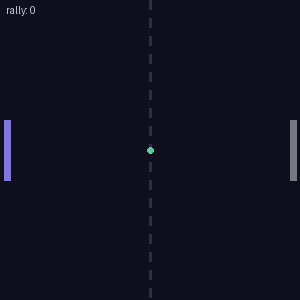
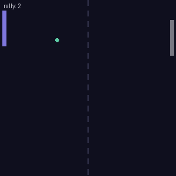
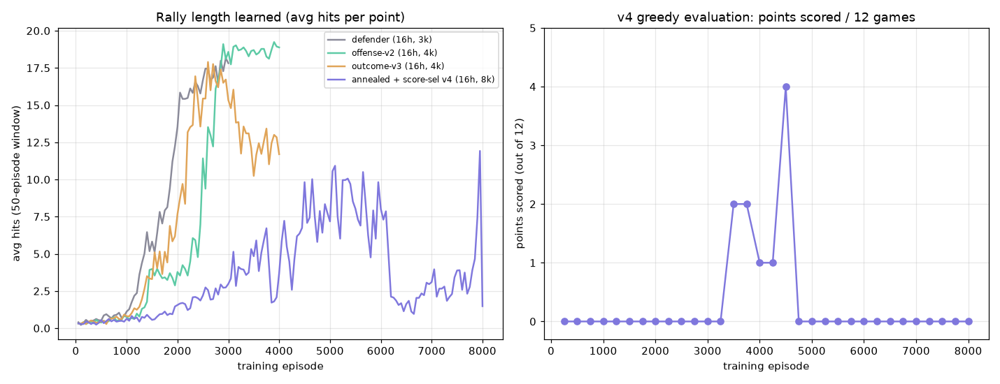

# NeuroPong — Evaluation Report

Training a from-scratch (NumPy, no PyTorch) neural network to play Pong with
**Deep Q-Learning**, and the honest story of trying to make it beat the
scripted opponent.

---

## TL;DR

- A `[5, 16, 3]` Q-network learns to **rally superbly** — 15–20 returns per point — from nothing but raw reward and hand-written backprop.
- Making it **score** against the ball-tracking bot is genuinely hard. Across four reward designs and up to 8,000 episodes, the best champion scores **~2–4 out of every 10–12 games**.
- The reason is not a bug — it's arithmetic: **the opponent moves vertically faster (2.1 u/step) than a single returned ball can (≈1.4 u/step)**, so it can almost always catch up. Beating it requires steepening the ball across several hits, a rare, unstable strategy.

| Animation | What it shows |
|---|---|
|  | The learned policy as a **wall** — an 8-hit rally, never missing. |
|  | The v4 champion **winning a point** — angling the ball past the bot. |

---

## Setup

**The brain.** A 2-layer feedforward Q-network, built from scratch:

```
state (5) ──▶ hidden (16, ReLU) ──▶ Q-values (3, linear)
```

The 5 inputs are the normalized game state (ball x/y, ball vx/vy, paddle y). The
3 outputs are the estimated future reward for each action `{down, stay, up}`;
the agent plays the `argmax`. Forward pass *and* backpropagation are written by
hand in `train_rl.py` — no autograd.

**The opponent.** A scripted bot (`pong.py`) that follows the ball's height at
**70% of paddle speed (2.1 u/step)**. Beatable in principle, but a strong tracker.

**The DQN machinery (all from scratch):**

| Component | Value |
|---|---|
| Discount γ | 0.95 |
| Learning rate | 5e-4 |
| Batch size | 64 |
| Replay buffer | 20,000 transitions |
| Target network refresh | every 500 steps |
| Exploration ε | 1.0 → 0.05 (decayed) |
| Reward | env (`+1` hit / `+2` score / `−1` miss) + shaping (below) |

---

## Results

Every row is the saved champion evaluated on fresh games.

| Run | Network | Episodes | Reward design | Avg hits/point | **Points / 10–12 games** |
|---|---|---|---|---|---|
| baseline | `[5,8,3]` | 2,000 | defense shaping only | ~2.8 | 0 |
| defender | `[5,16,3]` | 3,000 | defense shaping only | **~18** | 2 / 10 |
| offense-v2 | `[5,16,3]` | 4,000 | + reward steep returns | ~19 | 3 / 10 |
| outcome-v3 | `[5,16,3]` | 4,000 | + reward displacing the bot | ~12–18 | 2 / 10 |
| **v4** | `[5,16,3]` | 8,000 | annealed defense + **score-based selection** | variable (4–21) | best **4 / 12**, retest 2 / 10 |

**Doubling the hidden layer (8 → 16) was the single biggest win** — it took the
agent from a flailing 2.8-hit rally to a competent ~18-hit wall, and across the
threshold into occasionally scoring. Every reward tweak afterward moved scoring
only marginally.

### Learning curves



- **Left:** every run shows the signature *rise as exploration fades* — proof the policy (not luck) is improving. v4 (purple) is deliberately noisier: its defense reward is *annealed away* over training, trading pure rallying for offense attempts.
- **Right:** v4's greedy scoring over training. It **discovers** a scoring policy around episodes 3,500–4,500 (peaking at 4/12) then **loses it** — textbook RL instability / catastrophic forgetting. This is exactly why we select and save the *best-scoring snapshot*, not the final weights.

---

## Why the bot is hard to beat (the math)

The agent only controls one thing: the **angle** of its return, set by where the
ball strikes its paddle (`ball_vy += offset * 0.5`, offset ∈ [−1, 1]).

- A single hit adds at most **±0.5** to vertical speed; a returned ball's `|vy|` tops out around **~1.4**.
- The opponent tracks the ball's height at **2.1 u/step**.

Since **2.1 > 1.4**, the bot moves vertically faster than the ball does — over
the ~50 steps the ball takes to cross, it can almost always realign. The *only*
way to beat it is to **stack same-direction edge-hits across a rally** until
`|vy|` exceeds 2.1 — a precise, multi-step sequence that random exploration
rarely finds and gradient descent struggles to hold onto (see the right plot).
The agents therefore reliably learn the *easy, discoverable* skill (defense) and
score only on favorable geometry.

---

## The reward-shaping journey (the real lesson)

> **You get exactly what you reward** — the same truth as a fitness function in evolution.

1. **Defense shaping (potential-based).** `Φ(s) = −distance(paddle, ball)`, reward `γΦ(s') − Φ(s)`. Dense, policy-preserving, and it reliably taught rallying. But rewarding "don't miss" produces a perfect *defender* and nothing more.
2. **Offense attempt #1 — reward steep returns (v2).** *Failed.* It **fought** the defense reward: centering the ball on the paddle (what "don't miss" wants) produces a *flat* return. Two rewards in direct conflict; the dense, safe one won.
3. **Offense attempt #2 — reward the outcome (v3).** Reward the *opponent* being out of position while our shot travels. Better-targeted, but late training eroded defense without buying many scores.
4. **v4 — anneal + select on the right metric.** Start with strong defense shaping (learn to rally fast), then **decay it** so the agent is free to angle shots; and crucially, **select the champion by greedy score, not by hits** (selecting on hits was literally selecting *for defense*). This produced the best snapshot (4/12) — but also exposed how unstable that scoring policy is.

---

## Honest conclusion

The project's goal — *understand neural nets by building one from scratch* — is
fully met: a hand-written Q-network, with hand-written backprop, learns Pong
from raw reward. The stretch goal — *beat the bot* — runs into a real wall: this
opponent is mathematically tough, and reward shaping plateaus at ~2–4 scores per
10–12 games. That plateau, and *why* it exists, is itself the most valuable
result here.

**Next levers** (each a one-line experiment): lower the opponent's speed so the
task matches the agent's capability; train far longer with a more stable
algorithm (Double DQN, gradient clipping); or accept the excellent defender.

## Reproduce

```bash
pip install numpy pillow matplotlib

# Train the champion (≈ the v4 setup)
python train_rl.py --episodes 8000 --hidden 16 --seed 0 --out champion_rl_v4.npz

# Re-render the animations from any champion
python make_gif.py --model champion_rl_big.npz --out assets/defender_rally.gif --mode rally
python make_gif.py --model champion_rl_v4.npz  --out assets/attacker_score.gif --mode score

# Watch it live (needs pygame)
python watch.py --model champion_rl_v4.npz
```
